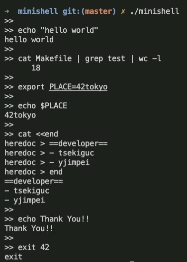

# minishell
- C言語でbashを再現しました
- 42tokyoの学生である[tsekiguc](https://github.com/sunix2019)と[yjimpei](https://github.com/JimpeiYamamoto)で共同開発



## 実行環境
- `Mac OS`
## インストール
### homebrewのインストール
下記のサイトから事前にインストールしてください
```
https://brew.sh/
```
### readlineのインストール
```
brew install readline
```
### リポジトリのクローン
```
git clone git@github.com:JimpeiYamamoto/minishell.git
```
## コンパイル
```
cd minishell
```
```
make
```
## 起動
```
./minishell
```

## 搭載機能
- コマンドの実行
	- 環境パス
	- 絶対パス
	- 相対パス
- ビルトインコマンド
	- echo (-n オプション)
	- exit
	- export
	- env
	- unset
	- cd
	- pwd
- リダイレクト
	- <
	- \>
	- \>\>
	- <<
- パイプ
- シングルクォート、ダブルクォートの解釈
- シグナル
	- ctrl + c
	- ctrl + d
	- ctrl + \
- 終了ステータス、エラーメッセージの再現
- コマンドの履歴
### minishellを心ゆくまでお楽しみください。
