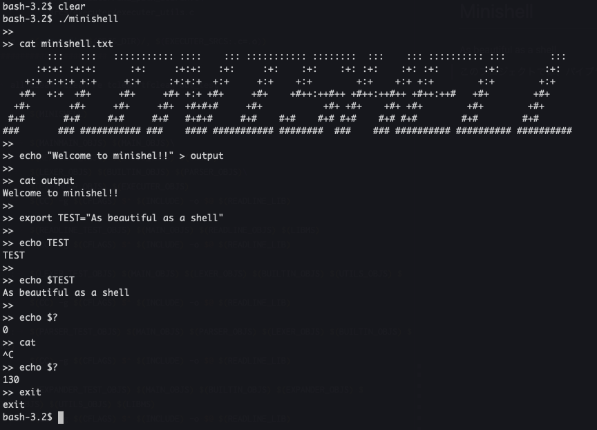

# Minishell

As beautiful as a shell  
このプロジェクトでは、パイプやリダイレクト等の基本的な機能を備えたシェルを自作しました。  
42東京の[tsekiguc](https://github.com/TaiyouSekiguchi), [yjimpei](https://github.com/JimpeiYamamoto)による共同開発です。



## 開発及び実行環境

Mac OS

## 使い方

readlineをhomebrewからインストールし、コンパイルして使用してください。

```bash
# readline　インストール
brew install readline

# リポジトリ　クローン
git clone https://github.com/TaiyouSekiguchi/minishell.git
cd minishell

# コンパイル
make

# 実行
./minishell
```

## 機能

### 基本機能

bashのようにコマンドを入力して実行することが出来ます。
環境変数PATHが設定されていれば、コマンド名だけで実行出来ます。  
環境変数PATHが設定されていない場合、絶対パスか相対パスで実行してください。

### ビルトインコマンド

| コマンド | 内容                       | オプション, 補足   |
| -------- | -------------------------- | ------------------ |
| echo     | 文字列を標準出力に出力     | -n                 |
| cd       | ディレクトリ変更           | 相対パス、絶対パス |
| pwd      | 現在の作業ディレクトリ表示 |                    |
| export   | 環境変数設定               |                    |
| unset    | 環境変数削除               |                    |
| env      | 環境変数表示               |                    |
| exit     | 終了                       |                    |

### クォーテーション

シングルクォーテーション、ダブルクォーテーションどちらも対応しています。
ダブルクォーテーションは$変数を展開します。

### 特殊記号

| 記号   | 内容                             |
| ------ | -------------------------------- |
| <      | 入力をリダイレクト               |
| >      | 出力をリダイレクト               |
| <<     | ヒアドキュメント                 |
| >>     | 出力をリダイレクト（追加出力）   |
| &#124; | コマンド間の入出力をパイプで接続 |
| $      | 環境変数展開                     |
| $?     | 終了ステータス                   |

### シグナル

| シグナル | 内容                         |
| -------- | ---------------------------- |
| Ctrl - C | 改行して新しいプロンプト表示 |
| Ctrl - D | シェル終了                   |
| Ctrl - \ | なにもしない                 |
